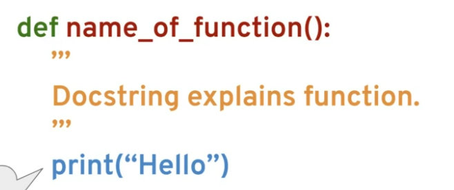

# Methods and Functions
***

# Methods
* built in objects in Python 
* there are many built in methods in python like .append() or .split() or .pop()
* in jupyter notebook shift+tab will show you info on the method
* the help function will give info on a method:
```
help(mylist.append)
```
* Offical Python Library Documentation: https://docs.python.org/3/library/index.html

# Intro to Functions
* you should create clean repeatable code
* functions allow you to create reusable blocks of code

# Def
* Syntax:

* Name: you should use all lowercase in the function name along with underscores (snake casing)
* Docstring: multiline comment where you can describe the function
* Code: code 
* To call the function: ```name_of_function()```
* functions can take paramaters:
```
def say_hello(name):
    message = (f'hello {name}')
    return message

say_hello("Donovan") 

# returns the name Donovan due to the return item
```

# Basics of Python Functions
* You can give a default value for a paramater like this:
```
def myfunc(myparam='default value'):
     # code
     return num1+num2

result = myfunc('param value')
```
* if you want to save the output of a function use ```return```
* you should have input validation to ensure your data is what it should be. You dont want a number being presented as a string for example

# Logic with Python Functions
* check for even number
```
def check_even(number):
    return number % 2 == 0

check_even(20) # would return True
```
* return true if any number is even inside a list
```
def check_even_list(num_list):
     for number in num_list:
         if number % 2 == 0:
            return True
         else:
            pass
      return False # this is if it passes on all odd numbers 

check_even_list([2,4,5]) # Would return True
```
* once you return the function is over
* if you wanted to return all the even numbers you could add the numbers to a new list and then return that list

# Tuple Unpacking with Python Functions


